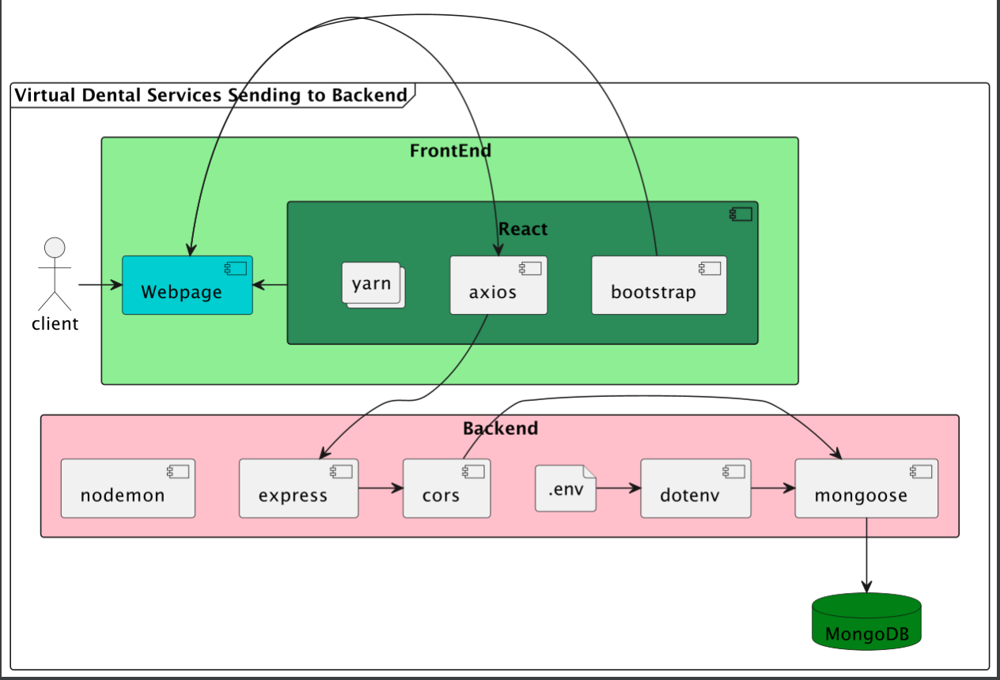

# Architecture
### The structure of Virtual Dental Services

----
#### ***Fig 1. Front End To BackEnd Server***

Figure 1 explains the process of how the client gets their requests sent
to the backend MongoDB database. This is meant to show the general use of 
the packages at play and how they are utilized to take in data. The client
begins by giving a webpage (provided to them by the React program)
their information. This can be an appointment scheduled at a given dentistry,
for example. The process is dealt to some capacity in the front end (getting the input), but
the data is swiftly sent to the backend using Axios for actual processing. 
In the backend, express is the general framework used to actually perform its precesses.
Express utilizes CORS to process the request made by Axios. With the data received,
it connects it to a given route (database model). The MongoDB is connected to the backend through Mongoose.
The data is sent to the MongoDB once it is formatted and once the proper credentials are provided to
it. The credentials are provided by a .env file which is utilized by the dotenv
package. This places data into a database.

-----
# Technology Choices

### Database
The database we utilize is a MongoDB database. This is a NoSQL database.
We are dealing with lots of data that needs analysing. 
Creating our hierarchical databases allows us to
create more flexible tables which will 
be utilized more fully whenever the customer needs
to be able to store the data they need specifically.
Also, by allowing business owners to use what they want,
creating strict database relationships would restrict their
freedom.

### Delivery
Currently, the delivery is the same for mobile and desktop
devices. This will be changed eventually, as
the formatting should be entirely different, since
what is convenient on mobile is annoying on pc, and vice-versa.

### Server
This product is designed to be run and built mostly wherever they want
as long as the company has access to the given dependencies,
it is their choice on how to deploy their product. 

### Development Tools
Due to the React being a popular, well documented and relatively easy to use
web application framework, we are using it in our product.

Due to most of the developers being familiar with NoSQL databases,
we are more inclined to use MongoDB.