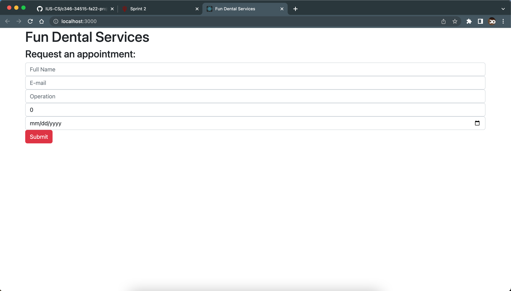

# Sprint Ceremony Minutes

Date: 2022-09-15

Members present:

* Joshua McCoy
* Abiy Addis
* Muruts Araya

  ## Demo

  This sprint, we completed:

* Proposal / Deciding on what we were making a website for
* Authors/Roles
* License
* README.md
* Bare website
* Set up communication and planning

  Here are screenshots of what we did:

  ## Retro

  [What is a Sprint Retrospective](https://www.scrum.org/resources/what-is-a-sprint-retrospective)

  ### Good

  * Proposal
  * Author Role
  * Planning
  * Quickly making decisions
  * clarity on the project
  * Being nice :)

  ### Bad

  * took a bit too long start
  * pulling and merging completed task
  * GITHUB
  * wish i had more sleep

  ### Actionable Commitments

  * As a team, we will...
    * get a move on early
    * get familiarize with merging and completed tasks
    * prior familiarizing of tools and platforms

  ## Planning

  Points | Story
  -------|--------
  8      | As a developer, I want my architecture planned out (making architecture.md)
  4      | As an developeer, I want the product to build so I can use it
  16     | As a group, we want to learn how to utilize the tools we are using to build our website
  8      | As a user, I want to be able to navigate the website
  4      | As a developer, I want to get feedback from the customers
  4      | As a developer, I want to be able to track our progress on the project
  8      | As a deveveloper, I want to make the product easily accessible (quality control)
  16     | As a business owner, I want to be able to schedule my office (customers and employees)
  16     | As employee, I want to be able to quickly provide invoices and financing for our services
  8      | As a secretery, I need minimal access to customer profile to do my job