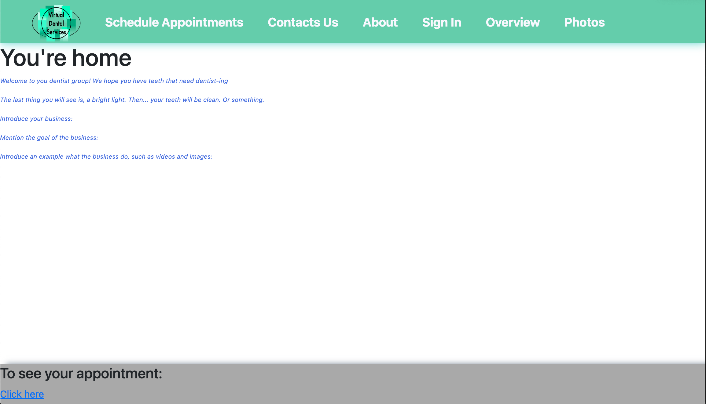
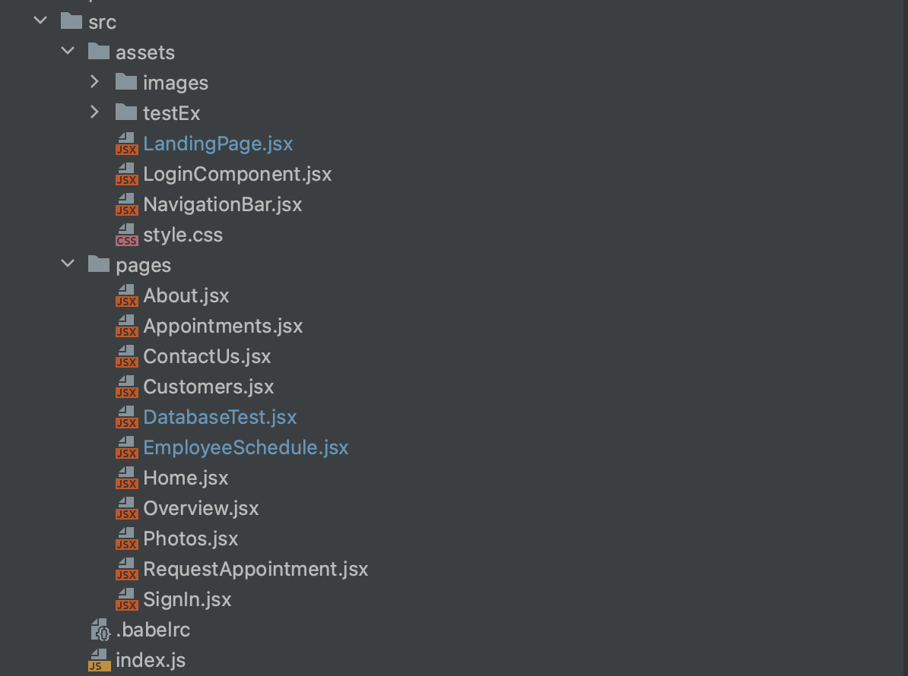

# Sprint Ceremony Minutes

Date: 2022-10-21
Members present:
* Mururs Araya
* Joshua McCot
* Abiy Addis

## Demo
This sprint, we completed:
* Built out lots of models for the backend to use
* Developed multiple pages for the front end project
* Created some components for frontend
* Filled out design patterns doc
* Added to architecture file
* Made basic testing framework 

  Here are screenshots of what we did:
  
  
## Retro
[What is a Sprint Retrospective](https://www.scrum.org/resources/what-is-a-sprint-
retrospective)

### Good
* Models created!
* Pages framework created!
* More caught up 
### Bad
* We don't have a lot of test cases
* Progress seems to be delayed (for about a week)
### Actionable Commitments
* As a team, we should have more early start ups in our sprints
* As a team, we should make more test cases 
* As a team, we should attempt to have more test driven development mentality
* As a team, we should improve our work efficiency

## Planning
(This section can and should be completed in your GitHub projects, but please
summarize here)

Points | Story
-------|--------
5      | As a business owner, I want customize the font of their application
6      | As a business owner, I want to have some pictures of my services/products 
4      | As a user, I want options to customize my experience once I'm signed in (profile page)
4      | As a business owner, I want my customers' login experience as friendly as possible
4      | As a developer, I want the frontend to be able to get info from the backend database
8      | As a user, I want to be able to login